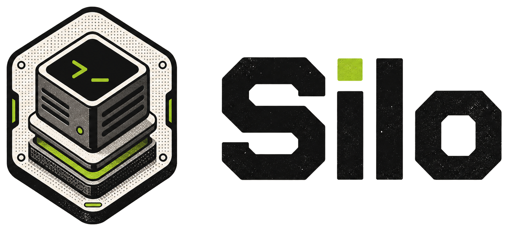

<p align="center">
  
</p>

# Silo

Silo is a local microVM sandbox runtime where machines are created from OCI images.

The short version:

1. OCI image in.
2. Runtime config from policy.
3. Small, isolated VM out.

## Core Principles

- **Image first**: OS images are built from OCI images.
- **API first**: `libvm` is the core runtime interface.
- **Policy first**: networking, kernel access, and userspace access are driven by policy.

Only network policies are implemented today. Kernel and userspace policies are the direction.

## CLI

Build the CLI locally:

```bash
nix develop
make build
```

Run an ephemeral VM from an image:

```bash
silo run --image ubuntu:24.04 -- uname -a
```

Create and enter a persistent VM:

```bash
silo create dev --image ghcr.io/vandycknick/archlinux:latest --start
silo shell dev
```

Inspect and manage machines:

```bash
silo ls
silo status dev
silo stop dev
silo rm dev
```

## SDK

Use `libvm` when you want to create and manage machines directly from Rust.

```rust
use libvm::{LibVmError, Memory, Runtime};

#[tokio::main(flavor = "current_thread")]
async fn main() -> Result<(), LibVmError> {
    let runtime = Runtime::from_env().await?;

    let machine = runtime
        .machine()
        .image("ghcr.io/vandycknick/archlinux:latest")
        .name("devbox")
        .cpus(6)
        .memory(Memory::gb(16))
        .network(|network| network.private())
        .create()
        .await?;

    machine.start().await?;

    Ok(())
}
```

## Docs

- [Terminology](docs/terminology.md)
- [Guest agent](guest/agent/README.md)
