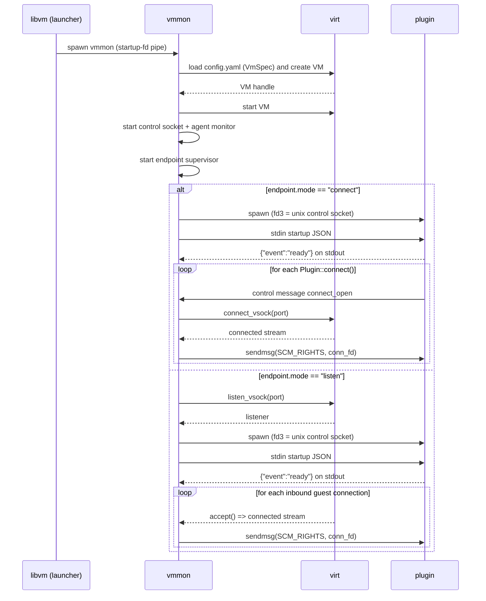

# 5. Vmmon Endpoint Plugins for Vsock Streams

Date: 2026-04-12

## Status

Implemented

## Context

`vmmon` already owns per-VM runtime supervision. It reads `config.yaml`, starts the VM, exposes the monitor control surface, and tracks VM and guest readiness.

Today, host to guest stream integrations are implemented as built-ins. `vmmon` already connects to guest vsock ports for things like the guest agent and shell access. That works for a small fixed set of features, but it does not scale well for arbitrary host to guest services. Every new service would require more built-in `vmmon` logic, more coupling to host virtualization details, and more monitor-specific code for behavior that does not belong in the core VM supervisor.

Bentobox needs a generic way for `vmmon` to launch long-running helpers that can consume host to guest byte streams without `vmmon` relaying data in userspace.

This ADR defines that mechanism as endpoint plugins.

The first implementation target is macOS Virtualization.framework. The plugin contract must remain driver-agnostic so the same plugin API can later be used by other host virtualization drivers.

## Decision

Bentobox will add declarative `vsock_endpoints` to `VmSpec` and `vmmon` will supervise vsock endpoint plugins for them.

Each configured endpoint binds together:

- a stable endpoint name,
- a vsock port,
- a runtime mode,
- a plugin command,
- lifecycle policy.

### Config model

The top-level `VmSpec` field is named `vsock_endpoints`.

Each vsock endpoint uses a config enum named `VsockEndpointMode` with these values:

- `connect`, meaning the host initiates a connection to a guest vsock port,
- `listen`, meaning the host accepts guest-initiated connections for a host vsock port.

The configured unit is called an endpoint throughout the spec, config, runtime state, and monitor reporting.

### Naming

The configured unit is a communication point defined by a port, a direction of initiation, and a plugin.

Candidate names considered:

| Name         | Pros                                                                    | Cons                                                            | Recommended |
| ------------ | ----------------------------------------------------------------------- | --------------------------------------------------------------- | ----------- |
| **endpoint** | Neutral, fits both connect and listen, matches runtime status reporting | Slightly generic                                                | **Yes**     |
| binding      | Conveys association between port and handler                            | Sounds like an OS bind operation, which does not fit `connect`  | No          |
| attachment   | Suggests a pluggable relationship                                       | Sounds like a lifecycle action rather than a config object      | No          |
| service      | User-facing and familiar                                                | Too semantic, implies higher-level protocol behavior            | No          |
| socket       | Technically related                                                     | Too low-level and ambiguous between listener, stream, and control socket | No          |

Decision: use `endpoint` in config, runtime state, plugin protocol, and monitor reporting.

### Plugin contract

Plugins are external processes launched by `vmmon`.

The plugin interface is intentionally small:

- `stdin`: exactly one startup JSON object, newline terminated,
- `stdout`: newline-delimited JSON events only,
- `stderr`: freeform logs,
- `fd 3`: the endpoint control socket.

Plugins must not need to know which host virtualization driver is in use.

### Data plane

All stream file descriptors handed to plugins represent connected, full-duplex, reliable byte streams. Plugins must treat them as generic nonblocking stream fds, not as TCP sockets or Unix sockets.

For `connect` mode:

- `vmmon` creates a Unix `socketpair` control socket,
- `vmmon` passes one end of that control socket to the plugin as `fd 3`,
- the plugin requests guest streams on demand over the control socket,
- `vmmon` opens a connected vsock stream to the configured guest port for each request,
- `vmmon` passes each connected stream back to the plugin over the control socket using `SCM_RIGHTS`.

For `listen` mode:

- `vmmon` creates a Unix `socketpair`,
- `vmmon` passes one end of that control socket to the plugin as `fd 3`,
- `vmmon` accepts guest-initiated vsock connections,
- `vmmon` passes each accepted connected stream to the plugin over the control socket using `SCM_RIGHTS`.

This keeps `vmmon` out of the data path while allowing one long-running plugin process to handle multiple guest connections in both modes.

### Diagrams

#### Boot and endpoint startup sequence



#### Listen accept and retry flow

```mermaid
flowchart TD
  A[Start listen endpoint] --> B{listen_vsock ok?}
  B -- no --> Z[Fatal: mark endpoint failed]
  B -- yes --> C[Spawn plugin with fd3 control socket]
  C --> D{Plugin ready before timeout?}
  D -- no --> E[Kill plugin and apply restart policy]
  D -- yes --> F[Accept loop]
  F --> G{accept() yields conn?}
  G -- error transient --> H[Log and retry with backoff]
  G -- error fatal --> I[Stop endpoint and apply restart policy]
  G -- conn --> J[send control message plus SCM_RIGHTS conn_fd]
  J --> K{send ok?}
  K -- yes --> F
  K -- ETOOMANYREFS or limits --> L[Backpressure and retry with backoff]
  K -- other error --> I
```

### Runtime reporting

`InspectResponse` does not expose per-endpoint runtime health.

Endpoint supervision does not change the existing meaning of instance readiness:

- `PingResponse.ok` remains driven by VM and guest readiness,
- `InspectResponse.ready` remains driven by VM and guest readiness.

Endpoint failures are handled by `vmmon` supervision, restart policy, and logs, not by redefining overall instance readiness.

### Protocol ownership

`protocol` does not define a runtime endpoint status model. The configured endpoint model remains owned by `bento-core` and the monitor only reports overall instance lifecycle state.

### Scope of first implementation

The first implementation is macOS-first and relies on the existing Virtualization.framework vsock support already surfaced through `virt`.

This ADR does not require every host virtualization driver to expose `listen_vsock` immediately. Drivers can adopt the same plugin contract as support lands.

## Consequences

### Positive

- `vmmon` stays generic and does not need service-specific built-ins for every new host to guest integration.
- Plugins can be written against one small API with no driver-specific logic.
- `vmmon` avoids becoming a per-byte relay in the hot data path.
- One plugin process can serve multiple guest streams in both `connect` and `listen` mode.
- Plugin startup failures stay isolated from core VM lifecycle readiness.

### Negative

- `vmmon` gains process supervision logic for plugins.
- `vmmon` must own fd hygiene, child process setup, restart policy, and stdout protocol parsing.
- Plugins must correctly handle raw nonblocking stream fds.

### Constraints

- The plugin API must stay driver-agnostic.
- Endpoint supervision must stay separate from instance readiness.
- The first implementation must work on macOS without depending on unfinished Linux listener plumbing.

## Appendix A: Config Schema

This ADR extends `VmSpec` with an optional top-level `vsock_endpoints` field.

```yaml
vsock_endpoints:
  - name: string
    port: 1..4294967295
    mode: connect|listen
    plugin:
      command: string
      args: [string]
      env: { KEY: string }
      working_dir: string
    lifecycle:
      autostart: bool
      startup_timeout_ms: int
      restart: never|on-failure|always
      backoff_ms:
        initial: int
        max: int
```

### Semantics

- `name` is the stable identifier used in logs, startup JSON, and runtime status.
- `port` is the vsock port associated with the endpoint.
- `mode` defines whether `vmmon` connects or listens.
- `plugin` describes the executable launched by `vmmon`.
- `lifecycle` controls startup timeout and restart behavior.

### Rust shape

```rust
use serde::{Deserialize, Serialize};
use std::collections::BTreeMap;
use std::path::PathBuf;

#[derive(Debug, Clone, Serialize, Deserialize)]
pub struct VsockEndpointSpec {
    pub name: String,
    pub port: u32,
    pub mode: VsockEndpointMode,
    pub plugin: PluginSpec,
    #[serde(default)]
    pub lifecycle: LifecycleSpec,
}

#[derive(Debug, Clone, Copy, Serialize, Deserialize)]
#[serde(rename_all = "snake_case")]
pub enum VsockEndpointMode {
    Connect,
    Listen,
}

#[derive(Debug, Clone, Serialize, Deserialize)]
pub struct PluginSpec {
    pub command: PathBuf,
    #[serde(default)]
    pub args: Vec<String>,
    #[serde(default)]
    pub env: BTreeMap<String, String>,
    #[serde(default)]
    pub working_dir: Option<PathBuf>,
}

#[derive(Debug, Clone, Serialize, Deserialize)]
pub struct LifecycleSpec {
    #[serde(default = "default_true")]
    pub autostart: bool,
    #[serde(default = "default_startup_timeout_ms")]
    pub startup_timeout_ms: u64,
    #[serde(default)]
    pub restart: RestartPolicy,
    #[serde(default)]
    pub backoff_ms: BackoffSpec,
}

#[derive(Debug, Clone, Copy, Serialize, Deserialize)]
#[serde(rename_all = "snake_case")]
pub enum RestartPolicy {
    Never,
    OnFailure,
    Always,
}

#[derive(Debug, Clone, Serialize, Deserialize)]
pub struct BackoffSpec {
    #[serde(default = "default_backoff_initial")]
    pub initial: u64,
    #[serde(default = "default_backoff_max")]
    pub max: u64,
}
```

Existing configs without `vsock_endpoints` remain valid by defaulting to an empty list. Legacy configs that still use `endpoints` are rejected by the current schema.

## Appendix B: Plugin Protocol

### Startup JSON

`vmmon` writes exactly one JSON object to plugin stdin as a single UTF-8 line.

```json
{
  "api_version": 1,
  "vsock_endpoint": "string",
  "mode": "connect" | "listen",
  "transport": "brokered_connect" | "listen_accept",
  "port": 0,
  "fd": 3
}
```

Rules:

- `api_version` must be `1`.
- `vsock_endpoint` matches the configured endpoint name.
- `mode` matches the configured endpoint mode.
- `transport` describes the control-socket contract for the selected mode.
- `port` matches the configured endpoint port.
- `fd` is always `3`.

### Stdout events

Plugins must write newline-delimited JSON events to stdout and must not write non-JSON text to stdout.

Required events:

```json
{ "event": "ready" }
```

```json
{ "event": "failed", "message": "string" }
```

No runtime status events are currently part of the plugin stdout protocol.

### fd 3 semantics

For both endpoint modes:

- `fd 3` is a Unix datagram control socket created by `socketpair()`.
- `vmmon` uses that control socket to exchange fixed-size control messages and optional `SCM_RIGHTS` fd attachments.
- Each received connection fd is a nonblocking generic byte-stream fd.

#### `mode: connect`

- plugins call `Plugin::connect().await?` to request a new guest stream,
- `vmmon` responds by opening a new vsock connection to the configured endpoint port,
- `vmmon` returns that connected stream fd via `SCM_RIGHTS`.

#### `mode: listen`

- plugins call `Plugin::accept().await?` to wait for the next guest-initiated connection,
- `vmmon` accepts guest-initiated connections on the configured endpoint port,
- `vmmon` returns each accepted stream fd via `SCM_RIGHTS`.

### Control protocol

Both modes share a single fixed-size control protocol carried over `fd 3`.

Control messages are versioned by a magic value and carry one message kind, one identifier field, one flags field, and an optional UTF-8 message payload.

```text
struct ControlMessageFrameV1 {
  u32 magic;
  u32 kind;
  u64 id;
  u32 flags;
  u32 message_len;
  u8 message[256];
}
```

Implemented message kinds:

- `connect_open`
- `connect_open_ok`
- `connect_open_err`
- `listen_incoming`

`connect_open_ok` and `listen_incoming` carry one connection fd via `SCM_RIGHTS`.

### Rust plugin API

The intended Rust API is instance-based. Plugins initialize once, then call `connect()` or `accept()` on that initialized plugin instance.

Illustrative outline:

```rust
use plugins::Plugin;

#[tokio::main]
async fn main() -> std::io::Result<()> {
    let plugin = Plugin::init("hello-world").await?;

    loop {
        let stream = plugin.accept().await?;
        tokio::spawn(async move {
            let _ = handle(stream).await;
        });
    }
}
```

`Plugin::init(...)` performs runtime setup and emits the initial `ready` event.

### Generic Rust plugin handling

Plugins must not assume the received connection fd is a TCP socket or a Unix socket. The portable contract is only that it is a nonblocking connected byte-stream fd.

In Rust, plugin implementations should treat received fds as owned file descriptors and wrap them in generic async I/O primitives rather than constructing `TcpStream` or `UnixStream` from them.

Illustrative outline:

```rust
use std::fs::File;
use std::os::fd::OwnedFd;
use tokio::io::unix::AsyncFd;

fn into_async_stream(fd: OwnedFd) -> std::io::Result<AsyncFd<File>> {
    let file = File::from(fd);
    AsyncFd::new(file)
}
```

That contract is compatible with the macOS-first implementation and with future drivers that also hand plugins generic stream fds.

## Appendix C: Runtime Reporting

There is no per-endpoint runtime status schema in `InspectResponse`.

`vmmon` owns endpoint supervision internally and treats plugin readiness/failure events as process-supervision inputs. Scripts that need endpoint definitions should read the VM spec, not monitor inspection output.
