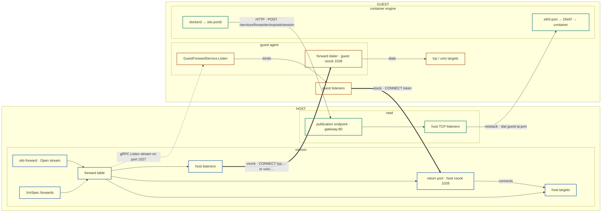
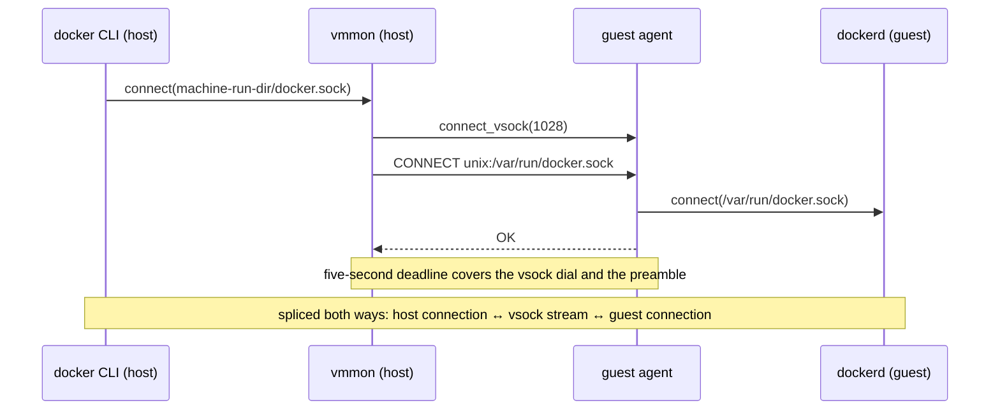
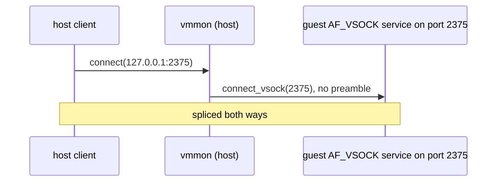
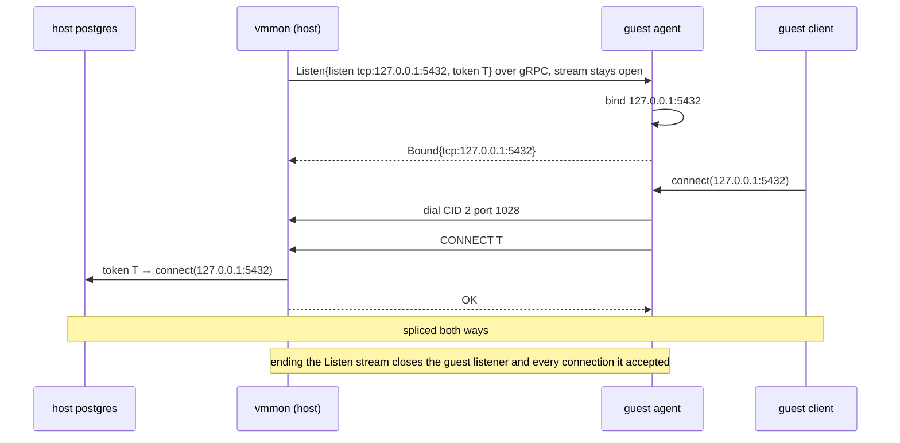
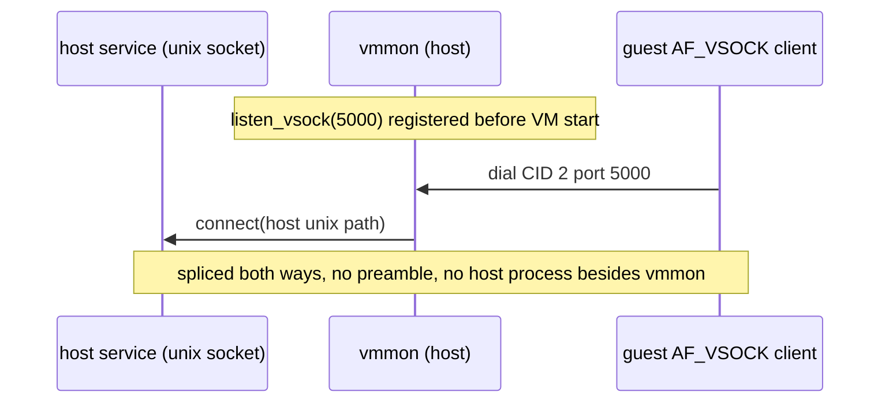
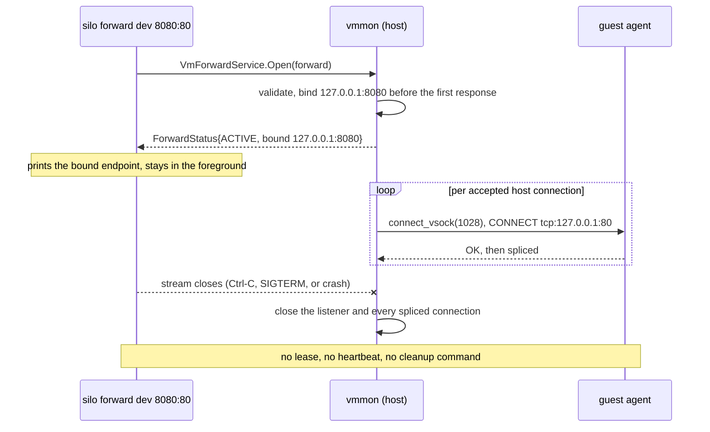
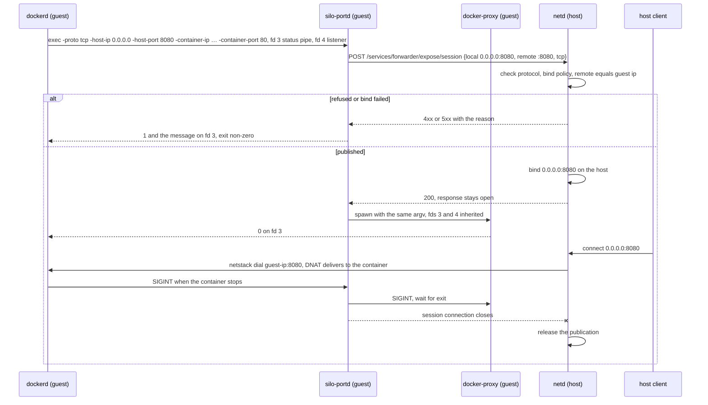
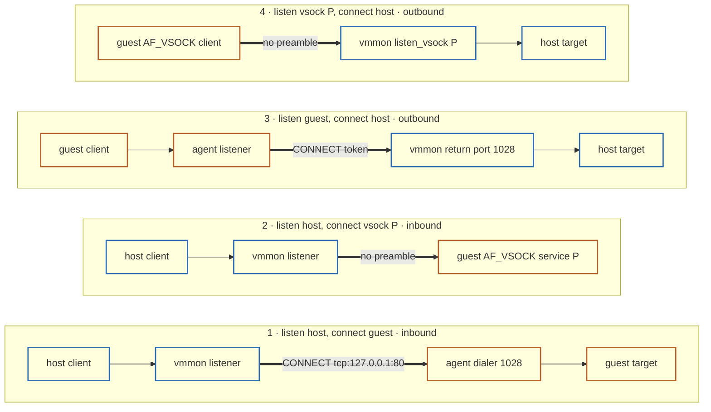
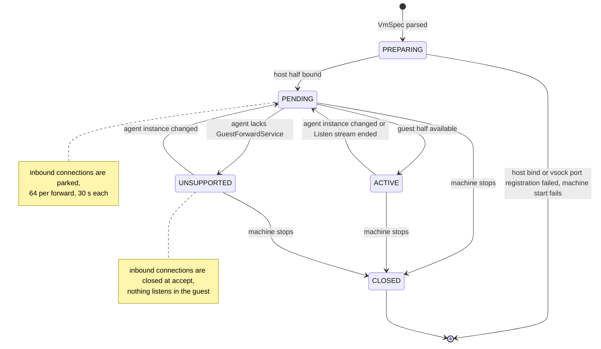

# 16. Forwarding: Machine- And Session-Scoped Vsock Forwards And Guest-Requested netd Publications

Date: 2026-09-01

Updated: 2026-09-02

## Status

Draft

Extends and amends [ADR 0015](0015-hybrid-vsock-host-surface.md). Relates to
[ADR 0006](0006-sandbox-network-policy-and-firewall-semantics.md),
[ADR 0008](0008-vmmon-host-and-guest-grpc-api.md), and
[ADR 0010](0010-static-guest-network-configuration.md).

## The Problem

[ADR 0015](0015-hybrid-vsock-host-surface.md) gives host software a raw byte
stream to any guest vsock port and lets guest software dial host Unix sockets.
It deliberately stops there: nothing in Silo turns those streams into the
things users ask for. Three needs remain unserved:

- **Explicit forwards.** A user wants `silo forward` to make a guest service
  reachable on a host address, the way `kubectl port-forward` publishes a pod
  port, and to make a host service reachable inside the guest, the way
  `ssh -R` does. Today that requires a guest-side `socat` and a host-side
  program that speaks the mux preamble.
- **Static service sockets.** The planned system VM runs a container engine.
  Its `/var/run/docker.sock` must appear as a host Unix socket so an unmodified
  `docker` CLI drives the engine in the guest, for the life of the machine,
  with no extra host process to supervise.
- **Dynamic container ports.** When a container publishes a port with `-p`,
  that port must appear on the host and disappear with the container. Docker
  Desktop and podman machine both provide this; Silo provides nothing.

Every earlier attempt at a two-way forwarding API in Silo failed on
vocabulary before it failed on code. "Host to guest" is ambiguous between the
direction connections are initiated and the direction bytes flow, and every
stream carries bytes both ways. A design that asks the user to choose a
direction, then explain which end listens, produces configurations nobody can
read back with confidence.

Two transports exist and each is right for a different job:

- The **hybrid vsock surface** (ADR 0015) carries byte streams between the
  host and guest ports. It exists whether or not the machine has networking,
  and with a guest-side peer it can reach any guest TCP port or Unix socket,
  including loopback-only services. It cannot carry UDP and it knows nothing
  about IP addresses inside the guest.
- The **netd virtual network** embeds `gvisor-tap-vsock`'s netstack. It can
  bind a host TCP address and dial the guest's interface address with no
  guest-side component, which is exactly how a container engine's DNAT rules
  expect to be reached. netd already constructs the upstream `PortsForwarder`
  and its HTTP mux (`net/netd/internal/virtualnetwork/virtualnetwork.go`) and
  serves them nowhere.

This ADR decides the forwarding model, which transport serves which case, what
the guest agent and `vmmon` gain, what netd must serve, and how `silo forward`
and the system VM compose those pieces.

## Terminology

| Term | Meaning |
| --- | --- |
| Forward | A host-configured rule with a listen endpoint and a connect endpoint. `vmmon` and the guest agent accept connections at the listen endpoint and connect each one to the connect endpoint over one vsock stream. |
| Listen endpoint | Where a forward accepts new connections. |
| Connect endpoint | Where a forward connects each accepted connection. Also called the target. |
| Endpoint side | The `host:` or `guest:` prefix on an endpoint. The side names the process that performs the socket operation: `vmmon` for `host:`, the guest agent for `guest:`. |
| Vsock endpoint | An endpoint written `vsock:<port>` that names a raw vsock port instead of a socket the agent operates. It replaces the guest half of a forward when the guest speaks vsock natively. |
| Inbound forward | A forward whose listen endpoint is on the host. Connections are host-initiated in ADR 0015 terms; a guest service becomes reachable from the host. |
| Outbound forward | A forward whose listen endpoint is in the guest. Connections are guest-initiated; a host service becomes reachable from inside the guest. |
| Machine-scoped forward | A forward in the `VmSpec`. Its configuration persists with the machine, and its listener exists for the life of each machine run. |
| Session-scoped forward | A forward created through the `vmmon` host API. It exists exactly as long as the gRPC stream that created it. |
| Forward dialer | The guest agent's listener on guest vsock port 1028. It reads one target line and connects to that guest address. |
| Forward return port | Host vsock port 1028, served by `vmmon`. The agent dials it for every connection accepted by an outbound forward and presents that forward's token. |
| Forward token | A 128-bit random value `vmmon` issues per outbound forward. The agent presents it on the return port. |
| Publication | A host TCP listener that netd binds because the guest asked for it. Connections are dialed to the guest's interface address through the netstack. |
| Publication endpoint | The gvproxy-compatible HTTP API netd serves on the gateway IP inside the virtual network. |
| Attachment-scoped publication | A publication created through the gvproxy-compatible API. It lives until an explicit unexpose or the guest attachment ends. |
| Session-scoped publication | A publication that lives exactly as long as the HTTP connection that requested it. |
| `silo-portd` | The guest binary a container engine execs per published port. It requests a session-scoped publication, then chains the engine's own userland proxy. |
| System VM | A long-lived machine built from a Silo-controlled image that runs a container engine. |

The words "forward" and "publication" are never interchangeable in this ADR.
A forward is configured by the host and carried by vsock. A publication is
requested by the guest and carried by netd.

## Decision

Silo provides two mechanisms with a fixed division of labor:

1. **Forwards are a core capability of `vmmon` and the guest agent.** A
   forward is a pair of endpoints, `listen` and `connect`. Exactly one is a
   `host:` endpoint that `vmmon` operates; the other is a `guest:` endpoint the
   agent operates or a raw `vsock:` port. Each accepted connection becomes one
   vsock stream. Forwards carry TCP and Unix-socket streams, work with
   `network: none`, reach guest loopback addresses, and never involve netd.
   Forwards are machine-scoped in the `VmSpec` or session-scoped through a
   `vmmon` gRPC stream for the caller's lifetime. `silo forward` opens a
   session-scoped forward.
2. **Publications are a netd capability for container engines.** A guest
   process asks netd, through the gvproxy-compatible publication endpoint, to
   bind a host TCP address and dial the guest's interface address. The
   endpoint is off by default and enabled per machine. netd never touches
   vsock and never learns about forwards.

Core invariants:

- The forward API has no direction field. Direction is a derived property of
  which endpoint carries the `host:` side, and it cannot change because the
  endpoints cannot change.
- The guest agent's forwarding primitives are two operations: connect a vsock
  stream to a guest address, and listen on a guest address and return each
  connection to the host over vsock. It has no forward table, no policy, and
  no knowledge of host addresses.
- `vmmon` owns every host-side socket a forward needs and the complete
  forward table. It binds a host TCP or Unix listener only for a machine- or
  session-scoped forward. The hybrid surface itself still never exposes vsock
  on TCP.
- Every forward and publication has an explicit scope whose end removes it:
  the machine run for machine-scoped forwards, a `vmmon` gRPC stream for
  session-scoped forwards, the guest attachment for attachment-scoped
  publications, and an HTTP connection for session-scoped publications. There
  are no orphan listeners and no lease protocol.
- The guest is untrusted. It can never name a host address. An outbound
  forward's host target is selected on the host, and the guest presents only
  an opaque token to reach it. A publication's host bind address is
  constrained by a per-machine policy.
- A host that wants to know whether a guest supports forwards asks one
  question through an existing mechanism: the gRPC health status of
  `silo.v1.GuestForwardService`. `vmmon` asks once per agent instance and
  caches the answer in `HostStatus`.

### Transport Selection

| Case | Mechanism | Path |
| --- | --- | --- |
| `silo forward` in either direction | Forward (session scope) | CLI keeps a `vmmon` stream open |
| Host `docker.sock` for a guest engine | Forward (machine scope) | `VmSpec` `forwards` entry |
| Host service reachable inside the guest | Forward | `listen: guest:...`, `connect: host:...` |
| Guest AF_VSOCK service, no agent involvement | Forward | `connect: vsock:<port>` |
| Container `-p` publication | Publication | `silo-portd` or podman calls the publication endpoint |
| Third-party tooling in any language | ADR 0015 surface | Mux and `<uds>_<port>` sockets, unchanged |
| Machine with `network: none` | Forwards only | Publications are unavailable by construction |

## Representative Flows

### Overview



Blue nodes belong to `vmmon`, orange nodes to the guest agent and its
sockets, green nodes to netd and the container engine. Thick edges are vsock
streams. The forward system and the publication system share no node.

### Inbound Forward Through The Agent: The Docker Socket

The `VmSpec` declares:

```yaml
forwards:
  - name: docker
    listen: host:unix:docker.sock
    connect: guest:unix:/var/run/docker.sock
```



1. `vmmon` binds `<machine-run-dir>/docker.sock` (mode `0600`) before the VM
   starts. The path exists as soon as `silo start` returns.
2. Per accepted connection, `vmmon` dials guest vsock port 1028, writes one
   target line, and waits for `OK`.
3. The agent connects to the named Unix socket inside the guest, replies
   `OK`, and splices. `vmmon` splices the host connection to the vsock stream.
4. A connection accepted before the agent is ready waits, bounded, for the
   agent; a refusal after that closes the host connection.

Neither side runs custom code beyond the agent and `vmmon`. The guest image
ships no bridge unit.

### Inbound Forward Without The Agent: A Raw Vsock Target

```yaml
forwards:
  - listen: host:tcp:127.0.0.1:2375
    connect: vsock:2375
```



No preamble is sent. This is the ADR 0015 mux path with the `CONNECT` line
supplied by configuration instead of by the client. It works with any guest
image whose service listens on AF_VSOCK, including images without the agent.

### Outbound Forward Through The Agent: A Host Database Inside The Guest

```yaml
forwards:
  - name: postgres
    listen: guest:tcp:127.0.0.1:5432
    connect: host:tcp:127.0.0.1:5432
```



1. When the agent is ready and reports `GuestForwardService` as serving,
   `vmmon` opens a `Listen` stream carrying the guest listen address and a
   fresh token. The stream stays open while the forward exists.
2. The agent binds the address in the guest and reports the bound address.
3. Per accepted guest connection, the agent dials host port 1028 and presents
   the token. `vmmon` maps the token to the forward's host connect endpoint,
   connects, replies `OK`, and splices.
4. Ending the `Listen` stream, for any reason, closes the guest listener and
   every connection it accepted.

### Outbound Forward Without The Agent: A Raw Vsock Listener

```yaml
forwards:
  - listen: vsock:5000
    connect: host:unix:/run/user/1000/some-service.sock
```

`vmmon` registers host vsock port 5000 with `listen_vsock`, and per guest dial
to `(2, 5000)` connects the host Unix socket and splices. This is the ADR 0015
`<uds>_5000` path with `vmmon` acting as the extension process, so no host
process needs to run to serve the guest.



### Held Forward: `silo forward`



The CLI holds one server-streaming RPC. Closing it, for any reason including a
crash, removes the forward. No lease, no heartbeat, no cleanup command.

### Publication: `docker run -p 8080:80 nginx` In The System VM



1. dockerd execs `silo-portd` with docker-proxy's argument contract and status
   pipe.
2. `silo-portd` opens a session-scoped publication. netd validates the bind address
   against the machine's publication policy, binds the host listener, and
   answers `200`. On any other answer, `silo-portd` reports the failure to
   dockerd through the status pipe and exits; `docker run` fails exactly as a
   native bind failure would.
3. `silo-portd` then spawns the engine's real `docker-proxy` with the same
   arguments and inherited descriptors, so the published port also remains
   reachable on the guest's own loopback, which DNAT does not cover.
4. When dockerd stops the container it signals `silo-portd`; `silo-portd`
   stops the chained proxy, closes the session HTTP connection, and exits. netd
   removes the publication when the connection closes. A `SIGKILL` closes the
   connection just the same.
5. Per host connection, netd dials `<guest-ip>:8080` through the netstack; the
   engine's DNAT rule delivers it to the container.

Podman in the same VM needs no `silo-portd`: it posts to
`gateway.containers.internal/services/forwarder/expose` natively, and its
publications live as long as the guest attachment. The image must carry
Podman Machine's `/etc/podman-machine` marker so an unmodified Podman enables
its gvproxy publication path.

## The Forward Model

### Endpoint Grammar

One grammar describes every endpoint in the `VmSpec`, on the CLI, in the
`vmmon` API, and on the wire between `vmmon` and the agent:

```text
endpoint        = host-endpoint / guest-endpoint / vsock-endpoint
host-endpoint   = "host:" address
guest-endpoint  = "guest:" address
vsock-endpoint  = "vsock:" vsock-port
address         = "tcp:" [ ip ":" ] port / "unix:" path
ip              = IPv4address / "[" IPv6address "]"
port            = canonical decimal, 0..65535
vsock-port      = canonical decimal u32
path            = one or more UTF-8 characters other than NUL, CR, or LF
```

Every address must fit in a 512-byte `CONNECT <address>\n` target line,
including the prefix and terminator. Programmatically constructed addresses
are subject to the same validation before a forward binds any socket.

A `tcp:` address without an IP means the loopback address of that side
(`127.0.0.1`). The IP is a literal; hostnames are not resolved by either
side, because name resolution inside the guest is a policy question this ADR
does not decide.

### Validity Rules

A forward is valid when all of the following hold. `vm-spec` enforces them at
parse time and `vmmon` enforces them again on the host API:

1. Exactly one of `listen` and `connect` is a `host:` endpoint.
2. The other endpoint is a `guest:` endpoint or a `vsock:` endpoint.
3. A `vsock:` listen endpoint does not name host port 1027 or 1028 and does
   not repeat another forward's `vsock:` listen port in the same machine.
4. A `tcp:` connect endpoint has a non-zero port. A `tcp:` listen endpoint may
   use port 0 to request an ephemeral port.
5. A `guest:unix:` path is absolute.
6. A `host:unix:` path is either absolute or a single normal path component.
   A relative component resolves inside the machine runtime directory, must
   not be a runtime-owned name (`vm.sock`, `vm.pid`, `vm.lock`, `krun.vsock`),
   must not equal the mux filename, and must not match the `<mux>_<digits>`
   listener pattern.
7. `mode` is present only when `listen` is a `unix:` endpoint and is an
   octal permission string.
8. `name`, when present, is unique among the machine's forwards.

The resulting matrix is the complete set of forward shapes:

| `listen` | `connect` | Host half (`vmmon`) | Guest half | Direction |
| --- | --- | --- | --- | --- |
| `host:*` | `guest:*` | binds host socket, dials guest 1028 with target line | agent dialer connects target | inbound |
| `host:*` | `vsock:P` | binds host socket, dials guest port P | native AF_VSOCK service | inbound |
| `guest:*` | `host:*` | serves return port 1028, connects host target | agent listener dials return port | outbound |
| `vsock:P` | `host:*` | registers host port P, connects host target | native AF_VSOCK client | outbound |
| `host:*` | `host:*` | rejected | | |
| `guest:*` | `guest:*` | rejected | | |
| `guest:*` | `vsock:P` | rejected | | |
| `vsock:P` | `guest:*` | rejected | | |
| `vsock:P` | `vsock:Q` | rejected | | |

```text
                         connect
                   host:      guest:     vsock:
                ┌──────────┬──────────┬──────────┐
         host:  │    ✗     │ inbound  │ inbound  │
                ├──────────┼──────────┼──────────┤
 listen  guest: │ outbound │    ✗     │    ✗     │
                ├──────────┼──────────┼──────────┤
         vsock: │ outbound │    ✗     │    ✗     │
                └──────────┴──────────┴──────────┘
```

Direction is never written down. "Inbound" and "outbound" appear in
diagnostics and documentation, derived from the row a forward lands in.

The four valid shapes, drawn as the processes involved. Thick edges are
vsock streams; shapes 1 and 3 need the agent, shapes 2 and 4 do not.



### Shape

The `VmSpec` gains a top-level `forwards` list. It does not live under `vsock`
because forwards do not require the public hybrid surface.

```yaml
forwards:
  - name: docker                              # optional, unique
    listen: host:unix:docker.sock             # runtime-dir relative
    connect: guest:unix:/var/run/docker.sock
  - listen: host:tcp:127.0.0.1:8080
    connect: guest:tcp:80                     # guest loopback
  - name: postgres
    listen: guest:tcp:127.0.0.1:5432
    connect: host:tcp:127.0.0.1:5432
  - listen: guest:unix:/run/host-docker.sock
    connect: host:unix:/var/run/docker.sock
    mode: "0666"
```

Rust shape:

```rust
/// One machine-scoped forward.
#[derive(Debug, Clone, PartialEq, Eq, Serialize, Deserialize)]
#[serde(rename_all = "camelCase")]
pub struct Forward {
    #[serde(default, skip_serializing_if = "Option::is_none")]
    pub name: Option<String>,
    pub listen: Endpoint,
    pub connect: Endpoint,
    /// Permission bits for a Unix listen socket. Default 0600.
    #[serde(default, skip_serializing_if = "Option::is_none")]
    pub mode: Option<UnixMode>,
}

/// Where a forward listens or connects. Serialized as the endpoint grammar.
#[derive(Debug, Clone, PartialEq, Eq)]
pub enum Endpoint {
    Host(Address),
    Guest(Address),
    Vsock(u32),
}

#[derive(Debug, Clone, PartialEq, Eq)]
pub enum Address {
    Tcp(SocketAddr),
    Unix(PathBuf),
}
```

`Endpoint` and `Address` serialize as strings in the grammar above, so YAML,
JSON, CLI arguments, and diagnostics all show the same text.

## Forward Data Plane

### The Target Line

The agent's forward dialer and `vmmon`'s forward return port share one
textual preamble, modeled on the ADR 0015 mux command:

```text
client → server:  "CONNECT " target "\n"
server → client:  "OK\n"                      then raw stream
                  "ERR " reason "\n"          then close
```

- On the dialer (guest port 1028) `target` is a guest `address` from the
  grammar, for example `tcp:127.0.0.1:80` or `unix:/var/run/docker.sock`.
- On the return port (host port 1028) `target` is a forward token, 32
  lowercase hexadecimal characters.
- The complete command, including the terminator, must fit in 512 bytes.
  Bytes after the newline belong to the stream and must not be consumed by
  the command reader.
- `reason` is one token from `invalid`, `refused`, `unreachable`, `not-found`,
  `permission`, `timeout`, `unsupported`, `capacity`. A server never sends
  free text.

The asymmetry is deliberate. The host is trusted and names guest addresses
directly. The guest is untrusted and names nothing; it presents a capability
`vmmon` issued to it.

### Inbound Connections

For a forward whose listen endpoint is `host:*`, `vmmon` runs one accept loop
per forward. Per accepted connection:

1. Apply the ADR 0015 peer-credential check to a Unix listener with the
   default mode. A forward that sets `mode` has chosen to share the socket,
   so the mode is the access decision and no UID check applies. TCP
   listeners have no peer credentials; the bind address is the access
   decision.
2. Reserve a vsock connection slot. If none is available, close the
   connection.
3. Dial the guest half. For `connect: vsock:P`, dial port P. For
   `connect: guest:*`, dial port 1028 and send the target line.
4. On `OK`, splice with `copy_bidirectional`. On `ERR`, refusal, or timeout,
   close the host connection without writing to it.

The whole of step 3 has a five-second deadline, matching the host API's
backend setup deadline, so a stalled guest cannot pin a host connection open
indefinitely before the stream exists.

A connection accepted while the guest half is not yet available (the VM is
booting, the agent has not reported ready, or the agent is restarting) is
parked rather than refused. `vmmon` parks at most 64 connections per forward
and for at most 30 seconds each; a parked connection is dialed when the
forward becomes active and closed when its timer expires or the forward
reaches a terminal state. Parking makes `docker ps` immediately after
`silo start` block briefly instead of failing.

### Outbound Connections

For a forward whose listen endpoint is `guest:*`, `vmmon` opens a
`GuestForwardService.Listen` stream once the agent is ready and serving that
service. For `listen: vsock:P`, `vmmon` registers host port P with
`listen_vsock` before the VM starts.

`vmmon` serves the forward return port, host vsock port 1028, whenever at
least one outbound forward with a `guest:*` listen endpoint exists. Per guest
connection to port 1028:

1. Read the target line. A malformed line or an unknown token closes the
   connection with `ERR invalid`.
2. Connect the host connect endpoint of the token's forward. A failure maps
   to `ERR refused`, `ERR not-found`, `ERR permission`, or `ERR timeout`.
3. Reply `OK` and splice.

The agent, per connection accepted by a guest listener, dials host port 1028,
sends the token, and on `OK` splices the guest client to the vsock stream. On
`ERR` or a reset it closes the guest client. The agent dials the return port
only from the listener stream's own task, so a listener that is torn down
stops producing return connections immediately.

### Capacity

Every forwarded connection, inbound or outbound, is one active vsock
connection and consumes one slot of the ADR 0015 allowance. This ADR reserves
a headroom for `vmmon`'s own traffic: the mux and forwards together may
consume at most `1023 - 16 = 1007` slots, so a busy forward cannot starve the
guest-agent status stream, SSH, exec, or filesystem RPCs. A forward connection
refused for capacity is closed without a reply and logged with the forward's
name and the limit.

Limits per machine: 128 forwards in total, of which at most 64 are
session-scoped; 64 parked connections per forward. Reaching a limit fails the
`Open` RPC or, for machine-scoped forwards, fails machine start with a
diagnostic that names the limit.

## Forward Lifecycle

### Machine-Scoped Forwards



- `vmmon` prepares every machine-scoped forward's host half before the VM starts:
  it binds `host:*` listen sockets and registers `vsock:` listen ports. A
  failure names the forward, the endpoint, and the error, and the machine
  does not start. This matches ADR 0015's treatment of the initial listener
  scan.
- Forwards whose guest half needs the agent are `PENDING` until `vmmon` has an
  agent identity and a serving `GuestForwardService`. A forward with
  `connect: vsock:P` is `ACTIVE` as soon as its host half is bound, because
  its guest half is not observable until a connection is attempted.
- `vmmon` reconciles the forward table against the agent whenever the agent
  instance changes: it reopens every outbound `Listen` stream with the same
  token and returns inbound forwards to `ACTIVE`. Parked connections drain
  when the forward becomes active.
- An agent that does not serve `GuestForwardService` moves the forward to
  `UNSUPPORTED`. The machine keeps running; `vmmon` logs once per agent
  instance and exposes the state through the host API. Inbound connections
  are closed at accept, so a client sees an immediate failure rather than a
  hang.
- At machine stop, `vmmon` closes forward listeners before stopping the VM,
  under the same shutdown ordering and drain deadline as the hybrid surface,
  and removes every Unix socket it created if its device and inode are still
  the ones it bound. Absolute Unix paths follow the same rule; `vmmon` never
  removes a socket it did not create.

### Session-Scoped Forwards

A session-scoped forward is created with `VmForwardService.Open`, a server-streaming
RPC on the machine's `vm.sock`. The request carries one `Forward`; the response
stream carries `ForwardStatus` snapshots on every state change.

- `vmmon` validates the forward, checks limits, and binds the host half before
  sending the first response. A failure is a gRPC status with an
  `ErrorDetail`; nothing remains bound.
- The first response reports `ACTIVE` with the bound address, `PENDING` if the
  guest half is not yet available, or `UNSUPPORTED`. A caller that requires a
  working forward waits for `ACTIVE`.
- The forward exists exactly as long as the stream. The client ending the
  stream, the client process exiting, or `vmmon` shutting down removes the
  forward, closes its listener, and closes every connection it spliced.
- A session-scoped forward that names a host Unix path resolves relative paths
  against the machine runtime directory, exactly like a machine-scoped forward. Clients
  that mean a path relative to their own working directory must send an
  absolute path.
- Session-scoped forwards are not persisted and do not survive `vmmon`
  restart. A client that wants a durable forward configures it on the machine.

`VmForwardService.List` returns the status of every machine- and session-scoped
forward, including its derived direction, bound address, state, and active
connection count.

## Guest Agent Contract

The agent gains one gRPC service and one raw vsock listener. Both are always
on: the agent serves only the host CID, and the host owner can already run
arbitrary guest commands through `GuestProcessService`, so forwarding grants
the host no authority it lacks today. The removed `forward` section of
`AgentConfig` stays removed.

### `GuestForwardService`

```proto
service GuestForwardService {
  // Bind a guest listener and return each accepted connection to the host
  // through vsock port 1028. The listener exists while this stream is open.
  rpc Listen(ListenRequest) returns (stream ListenEvent);
}

message ListenRequest {
  // Guest address in the endpoint grammar without the side prefix,
  // for example "tcp:127.0.0.1:5432" or "unix:/run/host.sock".
  string listen = 1;
  // 16 random bytes issued by vmmon; presented on the return port as hex.
  bytes token = 2;
  // Permission bits for a Unix listener. Default 0600.
  optional uint32 unix_mode = 3;
}

message ListenEvent {
  oneof event {
    ListenerBound bound = 1;      // sent once after a successful bind
    ListenerFailed failed = 2;    // terminal; the stream ends after it
  }
}

message ListenerBound { string address = 1; }   // actual address, port 0 resolved
message ListenerFailed { ErrorDetail error = 1; }
```

Semantics:

- The agent binds in the guest's root network namespace as root. For `tcp:`
  it sets `SO_REUSEADDR`. For `unix:` it removes an existing socket inode at
  the path before binding, never a non-socket entry, and applies
  `unix_mode`.
- Port 0 is permitted and the bound port is reported in `ListenerBound`.
- Per accepted connection the agent dials `(2, 1028)`, writes
  `CONNECT <token-hex>\n`, and waits at most five seconds for `OK`. Anything
  else closes the accepted connection.
- Cancelling the stream closes the listener, unlinks a Unix socket the agent
  created, and closes every connection it accepted. The agent holds no state
  about a listener after its stream ends.
- The agent admits at most 64 concurrent `Listen` streams and 1024 accepted
  connections in flight across them. Excess is refused with
  `RESOURCE_EXHAUSTED`.
- The service is registered with the health reporter and reflection like the
  existing guest services, and marked `NOT_SERVING` on shutdown.

### Forward Dialer

The agent listens on guest vsock port 1028 and accepts only connections whose
peer CID is the host. Per connection it reads one target line and connects to
the named guest address with a five-second deadline. It replies `OK` and
splices, or replies `ERR <reason>` and closes. The dialer is stateless: it
keeps nothing between connections and needs no configuration.

The dialer is reachable through the ADR 0015 mux as `CONNECT 1028`, so a
third-party host tool can reach a guest loopback service with no Silo
library:

```sh
# host: two preambles, then bytes
printf 'CONNECT 1028\nCONNECT tcp:127.0.0.1:80\nGET / HTTP/1.0\r\n\r\n' \
  | socat STDIO,ignoreeof UNIX-CONNECT:/run/user/1000/silo/machines/<id>/vsock.sock
```

### Capability Discovery

`vmmon` learns whether an agent supports forwards with one
`grpc.health.v1.Health/Check` for service `silo.v1.GuestForwardService`,
issued once the agent identity is established and repeated for each new agent
instance. `SERVING` enables forwards; `NOT_FOUND` or `NOT_SERVING` marks
agent-dependent forwards `UNSUPPORTED`. The result is cached in
`HostStatus.agent.enabled.services` as the list of serving Silo service names,
so libvm and the CLI learn it from a status they already fetch. This uses the
service inventory ADR 0008 already exposes and adds no negotiation protocol.

## vmmon Contract

### Host API

```proto
service VmForwardService {
  // Open a session-scoped forward that exists while this stream is open.
  rpc Open(OpenForwardRequest) returns (stream ForwardStatus);
  // Status of every machine- and session-scoped forward.
  rpc List(ListForwardsRequest) returns (ListForwardsResponse);
}

message OpenForwardRequest { Forward forward = 1; }

message Forward {
  optional string name = 1;
  string listen = 2;               // endpoint grammar
  string connect = 3;              // endpoint grammar
  optional uint32 unix_mode = 4;
}

enum ForwardDirection { FORWARD_DIRECTION_UNSPECIFIED = 0; INBOUND = 1; OUTBOUND = 2; }
enum ForwardScope     { FORWARD_SCOPE_UNSPECIFIED = 0; MACHINE = 1; SESSION = 2; }
enum ForwardState     { FORWARD_STATE_UNSPECIFIED = 0; PENDING = 1; ACTIVE = 2;
                        UNSUPPORTED = 3; CLOSED = 4; }

message ForwardStatus {
  Forward forward = 1;
  optional ForwardDirection direction = 2;
  optional ForwardScope scope = 3;
  optional ForwardState state = 4;
  optional string bound = 5;       // actual listen endpoint after bind
  optional uint32 active_connections = 6;
  optional uint32 refused_connections = 7;
  ErrorDetail error = 8;           // present for UNSUPPORTED and refusals
}
```

This is the contract's shape; field numbering and the exact `ErrorCode`
additions (`FORWARD_INVALID`, `FORWARD_ADDRESS_IN_USE`,
`FORWARD_UNSUPPORTED`, `FORWARD_LIMIT`) follow ADR 0008's versioning rules
when the proto lands. `Open` fails with `INVALID_ARGUMENT` for a grammar or
validity violation, `ALREADY_EXISTS` for a listen endpoint another forward
holds, `FAILED_PRECONDITION` when the VM is not running, and
`RESOURCE_EXHAUSTED` at a limit.

`HostStatus.agent.enabled` gains `repeated string services`, the serving Silo
service names observed for the current agent instance.

### Host Sockets

- `vmmon` binds Unix listen sockets with the same directory-relative,
  stale-socket, `0600`, and device-inode identity rules as the mux. The
  default mode is `0600`; `mode` may widen it, because a socket like
  `docker.sock` is sometimes shared with a group by its owner's choice.
- For an absolute Unix path, `vmmon` opens the parent with `O_NOFOLLOW`,
  requires it to be owned by its own effective UID, and records its device and
  inode. POSIX provides no dirfd-relative AF_UNIX bind, so after binding the
  pathname `vmmon` reopens the parent with `O_NOFOLLOW` and requires the same
  identity before accepting the listener. It does not require mode `0700`,
  because the owner chose the location.
- TCP listeners bind exactly the requested address. `vmmon` never widens a
  bind address and never binds a TCP address for any reason other than a
  machine- or session-scoped forward.
- `vmmon` applies the peer-credential check to every default-mode Unix
  listener it owns, with one shared helper for the mux, the host API socket,
  and forwards. A forward with an explicit `mode` is exempt by design.

### Reserved Vsock Ports

| Port | Guest namespace (host dials it) | Host namespace (guest dials CID 2) |
| --- | --- | --- |
| 22 | agent SSH listener; mux `CONNECT 22` allowed | not reserved; user `<uds>_22` allowed |
| 1027 | agent gRPC; mux `CONNECT 1027` allowed | Silo-internal handler or reset (ADR 0015) |
| 1028 | agent forward dialer; mux `CONNECT 1028` allowed | forward return port; `<uds>_1028` never routed |

Discovery ignores `<uds>_1028` exactly as it ignores `<uds>_1027`. libvm's
`vsock_listener_socket(1028)` returns `None`.

### Amendments To ADR 0015

This ADR amends ADR 0015 in three places. ADR 0015 remains Accepted; its text
is updated to point here.

1. **Reserved ports.** Port 1028 is reserved in both namespaces alongside
   1027, with the routing rules in the table above.
2. **TCP exposure.** "vmmon never exposes vsock on TCP" becomes: the hybrid
   surface never exposes vsock on TCP, and `vmmon` binds a host TCP or Unix
   listener only for a forward the machine owner configured in the `VmSpec` or
   holds through the authenticated host API. Bridging remains a deliberate
   act of the owner; it no longer requires an external process.
3. **Capacity headroom.** Of the 1023-connection allowance, 16 slots are
   reserved for `vmmon`'s internal connections. Public mux connections and
   forward connections share the remaining 1007.

## Publications

### Enabling

Publications are enabled per machine in the machine's network configuration,
not in the network policy, because ADR 0006 places inbound exposures outside
the outbound policy model and because enabling them is a trust decision about
this machine's guest:

```rust
pub enum MachineNetworkConfig {
    Private {
        policy: Option<NetworkPolicy>,
        /// Allow the guest to request host TCP publications through netd.
        publish: Option<GuestPublish>,
    },
    None,
    Named { name: String },
}

pub struct GuestPublish {
    /// Which host addresses the guest may bind.
    pub bind: PublishBind,           // Loopback | Any
}
```

libvm passes the setting to netd as `--guest-publish loopback|any`. Without
the flag netd serves no publication endpoint. `network: none` has no netd and
therefore no publications.

### Publication Endpoint

When enabled, netd serves HTTP on the gateway IP, port 80, inside the virtual
network. The endpoint is a netstack-terminated service like DNS on port 53: it
is reachable only from the attached guest and is not subject to the outbound
policy. `gateway.containers.internal` already resolves to the gateway IP in
netd's zones, so podman needs no additional DNS record.

Routes and bodies are wire-compatible with gvproxy so an unmodified podman
works:

| Route | Body | Behavior |
| --- | --- | --- |
| `POST /services/forwarder/expose` | `{"local","remote","protocol"}` | Bind `local`, dial `remote` per connection. Lives until `unexpose` or attachment end. |
| `POST /services/forwarder/unexpose` | `{"local","protocol"}` | Remove the publication. |
| `GET /services/forwarder/all` | | JSON array of publications for reconciliation. |
| `POST /services/forwarder/expose/session` | `{"local","remote","protocol"}` | Silo extension. Bind, answer `200` with the publication as the first chunk, keep the response open. Closing the connection removes the session-scoped publication. |

Request validation, applied identically to every route:

- `protocol` must be `tcp`. netd answers `400` with a body naming the
  protocol for anything else, including `udp`. podman surfaces that body in
  the container start error.
- `local` is `[host]:port`. An empty host, `0.0.0.0`, or `::` requests every
  interface and requires `bind: any`; otherwise netd answers `403`. A loopback
  host is always permitted. Any other host is refused with `400`, because netd
  does not enumerate host interfaces. Port 0 is refused.
- `remote` is `[host]:port`. An empty host means the attached guest's IP,
  which netd knows from its static lease. A non-empty host must equal that IP;
  anything else is refused with `400`. netd never dials outside the guest's
  address.
- `expose` is idempotent for an identical `(protocol, local, remote)` and
  answers `409` when `local` is already published with a different `remote`
  or by a session-scoped publication.
- A bind failure answers `500` with the operating-system error text, which is
  what gvproxy does and what podman expects.

### Scope

Every standard publication is attachment-scoped. netd is one process per
attached machine, so the table dies with the machine; there is nothing to
persist and nothing to reconcile after restart. A session-scoped publication
is additionally removed the moment its HTTP connection closes, which happens
when the requesting guest process exits for any reason, including `SIGKILL`,
because the guest kernel closes the socket and the netstack observes it.

### Audit

Every publication change produces an ADR 0006 audit record with
`family: "publication"`, a `phase` of `exposed`, `released`, or `denied`, the
scope (`attachment` or `session`), `local`, `remote`, and, for `denied`, the
reason (`protocol`, `bind_policy`, `conflict`, `bind_failed`).

### Data Path

Per host connection netd dials `remote` through the netstack and splices,
using the upstream `PortsForwarder`. Traffic arrives on the guest's interface
address, where a container engine's DNAT rules deliver it to the container. A
service bound only to guest loopback is not reachable through a publication;
that is what forwards are for.

## `silo-portd` And The System VM

`silo-portd` is a guest binary shipped only in images that run Docker. It
implements dockerd's userland-proxy contract exactly:

- dockerd execs it as `<path> -proto tcp -host-ip <ip> -host-port <port>
  -container-ip <ip> -container-port <port> [-use-listen-fd]`, with a status
  pipe on descriptor 3 and, with `-use-listen-fd`, a bound listening socket
  on descriptor 4.
- `silo-portd` requests a session-scoped publication of `host-ip:host-port`. On
  success it spawns the engine's real `docker-proxy` (default
  `/usr/bin/docker-proxy`, overridable with `SILO_PORTD_DOCKER_PROXY`) with
  the same arguments and both descriptors inherited, so `docker-proxy`
  performs the `0\n` status handshake and keeps the port reachable on guest
  loopback. `silo-portd` forwards `SIGINT` and `SIGTERM` to the child, waits
  for it, closes the session connection, and exits with the child's status.
  Linux parent-death signaling also terminates the child if `silo-portd` is
  killed before it can forward a stop signal.
- On a failed publication it writes `1\n<message>` to descriptor 3 and exits
  non-zero without starting a proxy, so `docker run` fails with netd's
  message.
- For `-proto udp` or `sctp` it writes a failure naming the protocol; UDP
  publication is an accepted limitation, not a silent no-op.

The system VM composes existing pieces and owns nothing exclusive. Its
machine configuration includes the docker socket forward, enables publications
with `bind: any` because Docker's default `-p` binds `0.0.0.0`, and its image
sets `"userland-proxy-path": "/usr/bin/silo-portd"` in `daemon.json`. A
`silo system up` command that assembles this configuration is future work
outside this ADR.

## `silo forward`

```text
silo forward <machine> <LISTEN> <CONNECT> [--name <name>]
silo forward <machine> <HOST-PORT>:<GUEST-PORT>
silo forward <machine> --list
```

- `LISTEN` and `CONNECT` are endpoints in the grammar. The command reads
  aloud as "listen here, connect there".
- `<HOST-PORT>:<GUEST-PORT>` is the only shorthand and expands to
  `host:tcp:127.0.0.1:<HOST-PORT>` and `guest:tcp:127.0.0.1:<GUEST-PORT>`.
  Every other shape is spelled out; the CLI does not guess sides.
- A relative `host:unix:` path is resolved against the CLI's working
  directory before it is sent, so the user's intuition and the RPC's
  absolute-path rule agree.
- The command requires a running machine, opens `VmForwardService.Open`,
  prints the bound endpoint once the forward is `ACTIVE`, and stays in the
  foreground. `Ctrl-C` or `SIGTERM` ends the stream and exits 0. A forward
  that becomes `UNSUPPORTED` exits non-zero with the agent's identity in the
  message. A machine that stops ends the stream and the command exits
  non-zero.
- `--list` prints `VmForwardService.List` with direction, scope, state, and
  bound endpoint.

Non-normative examples:

```sh
silo forward dev 8080:80                                   # guest loopback :80 on host :8080
silo forward dev host:tcp:0.0.0.0:8080 guest:tcp:80        # every host interface
silo forward dev host:unix:./docker.sock guest:unix:/var/run/docker.sock
silo forward dev guest:tcp:5432 host:tcp:5432              # host postgres inside the guest
silo forward dev host:tcp:2222 vsock:22                    # raw vsock target, no agent needed
```

## Responsibilities

| Concern | Owner |
| --- | --- |
| Forward grammar, validity rules, `VmSpec` `forwards` type | `vm-spec` |
| Forward table, host listeners, host targets, return port 1028, parking, capacity, `VmForwardService`, capability caching in `HostStatus` | `vmmon` |
| Forward dialer on guest port 1028, `GuestForwardService.Listen`, health registration | guest agent |
| Plumbing `forwards` and `vsock` through `MachineBuilder`, templates, and `config.json`; `publish` in `MachineNetworkConfig`; netd flag | `libvm` |
| `silo forward`, keeping the session stream open, endpoint parsing and shorthand | CLI |
| Publication endpoint, bind policy, scoped publications, audit records, netstack dialing | netd |
| `silo-portd`, `daemon.json`, DNAT delivery | the guest image (system VM image for Docker) |
| Calling the publication endpoint natively | podman (unmodified) |

`libvm` does not proxy streams and does not speak the target line. It gains a
`Machine::open_forward` wrapper over the RPC and exposes `forwards` and
`publish` through its builders, the CLI, and the SDK DTOs; today nothing
writes `spec.vsock`, and forwards must not inherit that gap.

## Security And Trust

- The agent's dialer and `Listen` service accept only the host CID, like the
  existing agent gRPC listener. Within the guest, any root process could reach
  host port 1028 through AF_VSOCK; the token is what stands between it and a
  host target, and it grants exactly the access the guest listener already
  offers every guest process. A token is never logged.
- The guest cannot name a host address anywhere in this design. Outbound
  forward targets are chosen in the `VmSpec` or over the UID-checked host
  API. Publication bind addresses are chosen by the guest but constrained to
  loopback unless the machine owner granted `any`, and the dial address is
  pinned to the guest's own IP.
- Host Unix sockets `vmmon` creates are `0600` and UID-checked unless the
  owner widens them with `mode`, which also disables the UID check for that
  socket. TCP listeners bind exactly the address the owner wrote; the default
  for a bare port is loopback on both sides.
- Session-scoped forwards and `List` are served on `vm.sock` under the ADR 0008
  peer-UID check. A user who can open a forward can already exec in the guest.
- Publications widen the guest's authority: it can make netd bind host ports.
  The per-machine gate, the bind policy, and audit records bound that
  exposure. A sandbox machine never enables `publish`.
- netd never dials anything but the attached guest's IP on behalf of a
  publication, so a guest cannot use the host as a relay to other hosts.

## Failure Semantics And Diagnostics

- A machine-scoped forward whose host half cannot be bound or registered prevents
  machine start; the diagnostic names the forward, the endpoint, and the
  error.
- A session-scoped forward whose host half cannot be bound fails the `Open` RPC with
  the statuses listed above; nothing stays bound.
- An inbound connection whose guest half refuses, times out, or answers
  `ERR` is closed without any bytes written to the client. `vmmon` logs the
  forward name, the target, and the reason at debug level, and increments a
  per-forward refusal count reported by `List`.
- An outbound return connection with an unknown token is answered
  `ERR invalid` and logged at warn level once per minute per forward, because
  it indicates a guest process probing the return port.
- An agent instance change returns agent-dependent forwards to `PENDING` and
  closes their spliced connections; `vmmon` reopens `Listen` streams when the
  new instance is ready. Parked connections outlive the transition up to
  their 30-second bound.
- An agent without `GuestForwardService` produces one warn log per agent
  instance and `UNSUPPORTED` in `List` and in `Open` responses. It does not
  affect readiness, matching ADR 0015's rule that vsock activity never
  changes `HostStatus.readiness`.
- A publication request refused by policy produces a `denied` audit record
  and an HTTP error whose body names the reason. A bind failure produces the
  operating-system error in the body.
- netd removes every publication when the attachment ends. A `silo-portd`
  killed with `SIGKILL` releases its publication as soon as the netstack
  observes the closed connection, without waiting for the attachment to end.
- Forward and publication activity never changes `HostStatus.readiness`.

## Prior Art: Docker Desktop And Podman Machine

Both products solve the same three problems: a host socket for an engine that
runs in a VM, host services reachable from inside the guest, and container
port publication. Their choices explain several of this ADR's.

| | Docker Desktop | podman machine | Silo (this ADR) |
| --- | --- | --- | --- |
| Engine socket transport | vsock (`AF_HYPERV` on Windows) | SSH over gvproxy's userspace TCP stack | vsock |
| Guest half of the socket forward | `vsudd`, a daemon with a static `-inport <vsock-port>:unix:<path>` table baked into the VM image | `sshd`; gvproxy opens an SSH stream-local channel to the guest socket path | agent dialer on port 1028; each connection names its target |
| Host half | `com.docker.backend`, an HTTP-aware proxy that parses Engine API requests | gvproxy, a byte relay per connection | `vmmon`, a byte relay per connection |
| Requires the virtual network | no | yes | no |
| Reaches a new guest socket without changing the image | no, one `vsudd` entry per socket | yes | yes |
| Host service exposed as a socket inside the guest | yes, `/run/host-services/ssh-auth.sock` | no | yes, any outbound forward |
| Container port publication | the API proxy intercepts `-p` and asks the backend to bind | podman posts to gvproxy's `/services/forwarder/expose` | `silo-portd` or podman posts to netd's publication endpoint |

### The Host Half: Byte Relay Or API Proxy

Docker Desktop's host process terminates the Docker Engine HTTP API before
relaying it over vsock, and uses that position to change requests. When a
developer runs `docker run -p 80:80`, the proxy decodes the request and asks
the backend to bind the host port first, so a port collision is reported to
the developer before the container exists. It validates bind-mount paths
against the shared-directory list and reports `Mounts denied` on the host
instead of a missing-path error from inside the VM, and on Windows it rewrites
`C:\...` paths to their VM-side mount. gvproxy and Silo's `vmmon` do none of
this: a forward is a byte relay and knows nothing about HTTP.

This ADR keeps the relay dumb on purpose. Publication does not need the
proxy, because the engine itself reports each published port through
`silo-portd`. Bind-mount validation and path rewriting are properties of how
the system VM shares the host filesystem, not of forwarding, and a component
that needs them can sit in front of `docker.sock` later without changing the
forward beneath it.

Silo's raw shape, `connect: vsock:<port>` against a guest
`ListenStream=vsock::<port>` unit, is exactly Docker Desktop's `vsudd` model:
one vsock port per socket, declared in the image. The forward dialer is what
removes the per-socket declaration. Silo supports both; neither product does.

### The Reverse Direction

Docker Desktop places a Unix socket at `/run/host-services/ssh-auth.sock`
inside its VM. Connections to it are carried over vsock to the host backend,
which connects to the user's `$SSH_AUTH_SOCK`, so `git` and `ssh` inside a
container sign with host keys that never enter the VM. Containers bind-mount
the socket and set `SSH_AUTH_SOCK` to it. This has to be a socket forward and
not a network alias, because an SSH agent is a Unix-socket protocol with no
TCP port. podman machine has no equivalent.

In this ADR that use case is one outbound forward, and it reads as what it
does:

```yaml
forwards:
  - listen: guest:unix:/run/host-services/ssh-auth.sock
    connect: host:unix:/run/user/1000/ssh-agent.sock
    mode: "0666"
```

The difference from Docker Desktop is that the guest side of the socket is a
declaration rather than an image feature, so a machine can expose any host
Unix socket or loopback TCP service at any guest path or port, and the guest
sees it at an address an unmodified client already expects.

## Consequences

### Benefits

- One vocabulary for both directions with no direction field. A forward is
  read back exactly as it was written: listen here, connect there.
- Two guest primitives cover every shape: connect a stream to a guest
  address, or listen on a guest address and return connections. Neither
  holds a table, and the dialer holds no state at all.
- Forwards work without networking, reach guest loopback and Unix sockets,
  and are identical in code path for machine and session scopes, so `docker.sock`
  and `silo forward` share every test.
- Teardown is structural everywhere: process exit, stream close, HTTP
  connection close, attachment end.
- The public ADR 0015 surface gains the dialer for free: any tool that can
  send two preambles reaches a guest loopback service.
- Capability discovery reuses gRPC health; no negotiation protocol is added
  and the same mechanism answers the question for any future service.
- Podman machine images work unmodified against the publication endpoint,
  and Docker needs one small guest binary that chains its own proxy.

### Tradeoffs

- `vmmon` grows: a forward table, host listeners, a token map, parking, and
  one more gRPC service. ADR 0004 asks it to stay a runtime monitor; forwards
  are argued here to be part of the machine's runtime surface, like the mux,
  rather than manager policy.
- Two data planes remain. A user must know that `-p` ports arrive through
  netd on the guest's interface address, while everything else arrives
  through vsock. The disjoint vocabulary is meant to make that visible.
- Every forwarded byte is relayed by `vmmon` and, for `guest:` endpoints, by
  the agent as well. This is the cost ADR 0015 already accepts for the mux,
  paid once more inside the guest.
- Outbound forwards need the agent to be ready. A guest client that connects
  before the agent binds sees a refused connection, which is the same as any
  service that has not started yet.
- Publications are TCP only and dial the guest over IPv4. Host listeners may
  be IPv4 or IPv6, and do not reach guest loopback-only services.
- Port 1028 joins 1027 as a reserved port in both namespaces, one more name
  users cannot publish.

## Alternatives Considered

### `silo forward` Over netd

netd can bind a host TCP address and dial the guest's interface without any
guest component, and the earlier draft of this ADR put `silo forward` there.
It loses because a machine with `network: none` would have no `silo forward`
at all, because it cannot reach loopback-bound guest services, which is what
`silo forward 8080:80` overwhelmingly means, because it cannot carry Unix
sockets, and because it would require a second host-side control surface on
netd whose only client was the CLI. The netstack's strength, dialing the
guest's interface address with no guest cooperation, is exactly what
container publication needs and nothing else does.

### A Direction Field

Writing `direction: host-to-guest` alongside `host:` and `guest:` addresses
was the shape of every previous attempt. It loses because it encodes the same
fact twice and lets the two disagree, and because "host to guest" does not say
whether it describes connection initiation or byte flow. Deriving direction
from the side of the listen endpoint removes the field and the ambiguity.

### One Vsock Port Per Forward

`vmmon` could allocate a guest vsock port per inbound forward and have the
agent bind it, avoiding the target line. It loses because it needs a
registration RPC before any connection can be made, it spends the ADR 0015
listener allowance on macOS, and it makes the agent stateful for the simplest
case. A single dialer port with a per-connection target line is the SSH
`direct-tcpip` model: the request carries its destination and the server
keeps nothing.

### Framing Forward Streams In gRPC

A bidirectional `Forward` RPC on the existing agent channel would need no new
vsock port and no textual preamble. It loses because every byte would be
chunked, framed, and copied through tonic on both ends, because it puts the
data plane on the same HTTP/2 connection as status and exec streams, and
because it would be invisible to the ADR 0015 mux. Raw vsock streams with a
32-byte-class preamble are the convention the surface already uses.

### Forwarding Code Only In The Guest Image

Shipping a bridge unit (`systemd-socket-proxyd`, `socat`) per forward keeps
the agent unchanged. It loses because the agent is injected into every
managed launch by ADR 0009, so the "keep it out of sandbox images" argument
does not apply, because it needs a guest port per forward declared before
boot, and because it cannot do outbound forwards at all without a
guest-resident program that knows a host port.

### Docker Desktop's Vsock Demultiplexer For Publications

Docker Desktop carries published ports over vsock to an in-VM demultiplexer.
Silo could route `-p` through the forward dialer instead of netd. It loses
because the dialer connects to guest loopback, and Docker's DNAT rules do not
apply to loopback destinations; the connection would have to target the
guest's interface address, at which point netd already does this with no
guest-side hop and with the address knowledge the netstack has anyway.

### Scanning The Guest For Bound Ports

Watching `/proc/net` from the agent would publish services no engine asked
for. Neither Docker Desktop nor podman does this: it cannot distinguish
intent, races startup, and forwards ports that were never meant to leave the
guest. Publication is an explicit act of the workload manager.

### Publications In The Network Policy

ADR 0006 reserves a `forwards` section in the policy document, and netd
already rejects it as unimplemented. Putting the publication gate there loses
because policy changes are durable full-policy replacements and the gate is a
machine attribute, and because that section is meant for exposures that need
the network's identity (a future Tailscale kind) rather than a guest-requested
host bind. The section stays rejected; see the non-decisions below.

## Accepted Limitations

- Publications carry TCP to the guest over IPv4. IPv4 and IPv6 host listeners
  are supported. `-p 53:53/udp` fails with a message
  naming the protocol.
- Publications reach only addresses on the guest's interface. Guest loopback
  services need a forward.
- Forwards carry stream sockets only. UDP has no place in this design.
- Hostnames are not accepted in endpoints; addresses are IP literals.
- Guest listeners bind in the root network namespace. Reaching into a
  container's namespace is not supported.
- Session-scoped forwards do not survive `vmmon` restart, by construction.
- A forward whose guest half depends on the agent is unavailable to images
  launched with the agent disabled.
- Port 1028 cannot be published by users in either namespace.

## Open Questions

- Whether the SDKs expose session-scoped forwards as a first-class object with a
  cancellation-safe handle, given the Go FFI's current mutation-cancellation
  constraints.
- Whether `silo show` should display active forwards and publications, which
  for publications requires a host-side inventory netd does not yet serve.
- Whether a `vsock:` connect endpoint should be validated at forward
  creation by an immediate probe, or remain lazy as specified.

## What This Does Not Decide

- The `silo system up`/`down` command, the system VM image contents, and its
  update channel. This ADR fixes only the configuration they compose.
- A host-side control socket on netd. ADR 0010 anticipates one for named
  networks; when it exists it may expose the publication table. Until then
  host tooling observes publications through audit records.
- The ADR 0006 policy `forwards` section, including a Tailscale-fronted
  exposure kind. netd continues to reject it, and deciding it requires the
  named-network work.
- Any change to ADR 0015's mux protocol, discovery, or listener naming
  beyond the three amendments listed above.
- Name resolution inside endpoints.

## Implementation References

- `runtime/vmmon/src/vsock/mux.rs`: `handle_connection` splits at the
  preamble; the dial-and-splice half is shared with inbound forwards.
- `runtime/vmmon/src/vsock/paths.rs`: `OwnedMux` bind, `0600`, and
  device-inode cleanup rules generalized to forward listeners.
- `runtime/vmmon/src/virt/capacity.rs`: the 1023 allowance and the new
  headroom.
- `runtime/vmmon/src/guest.rs`: agent identity and readiness tracking where
  the health check for `GuestForwardService` is issued.
- `guest/agent/src/rpc.rs`, `guest/agent/src/server.rs`: service
  registration and the vsock accept-loop helper the dialer reuses, with the
  host-CID peer check added.
- `specs/protocol/proto/` and `specs/protocol/src/lib.rs`: new
  `forward.proto` and the descriptor inventory test.
- `specs/vm-spec/src/lib.rs`: `forwards`, `Endpoint`, `Address`.
- `runtime/libvm/src/network/api.rs` and
  `runtime/libvm/src/network/netd_driver.rs`: `publish` on
  `MachineNetworkConfig::Private` and the `--guest-publish` flag.
- `net/netd/internal/virtualnetwork/virtualnetwork.go`: the unserved
  services mux; `forwardHostVM` must return the `*PortsForwarder` so netd can
  own the table.
- `net/netd/internal/gateway/audit/audit.go`: audit event shape gaining a
  publication family.

## External References

- [Firecracker: Using the Virtio-vsock Device](https://github.com/firecracker-microvm/firecracker/blob/main/docs/vsock.md)
- [RFC 4254 §7: SSH connection protocol TCP/IP port forwarding (`direct-tcpip`, `tcpip-forward`)](https://www.rfc-editor.org/rfc/rfc4254#section-7)
- [gvisor-tap-vsock services API and `PortsForwarder`](https://github.com/containers/gvisor-tap-vsock)
- [podman: `libpod/networking_machine.go`](https://github.com/containers/podman/blob/main/libpod/networking_machine.go)
- [moby: `cmd/docker-proxy/main_linux.go` (status pipe and `-use-listen-fd`)](https://github.com/moby/moby/blob/master/cmd/docker-proxy/main_linux.go)
- [moby: `daemon/libnetwork/portmapper/proxy_linux.go` (userland proxy invocation)](https://github.com/moby/moby/blob/master/daemon/libnetwork/portmapper/proxy_linux.go)
- [vpnkit port forwarding design (`docs/ports.md`)](https://github.com/moby/vpnkit/blob/master/docs/ports.md)
- [linuxkit/virtsock `cmd/vsudd/main.go` (Docker Desktop's guest-side vsock-to-Unix-socket daemon)](https://github.com/linuxkit/virtsock/blob/master/cmd/vsudd/main.go)
- [gvisor-tap-vsock `pkg/sshclient/ssh_forwarder.go` (podman machine's SSH socket forward)](https://github.com/containers/gvisor-tap-vsock/blob/main/pkg/sshclient/ssh_forwarder.go)
- [podman `pkg/machine/shim/networking.go` (gvproxy `-forward-sock` setup)](https://github.com/containers/podman/blob/main/pkg/machine/shim/networking.go)
- [Docker Desktop networking how-tos (SSH agent forwarding)](https://docs.docker.com/desktop/features/networking/)
- [gRPC Health Checking Protocol](https://github.com/grpc/grpc/blob/master/doc/health-checking.md)
