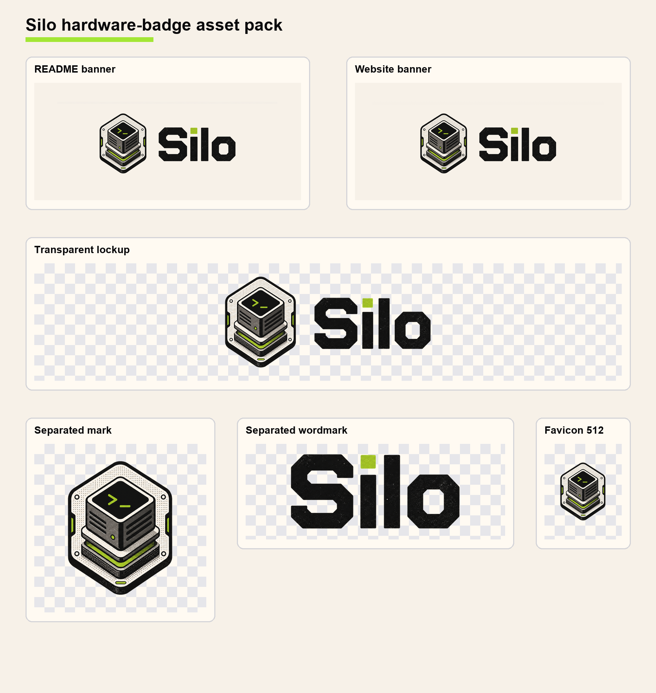

# Silo Brand Assets

This folder contains the selected Silo hardware-badge logo direction and the derived raster assets for docs, website usage, social previews, and favicons.

## Asset Guide

| Use case | File | Notes |
| --- | --- | --- |
| README banner | `silo-readme-banner.png` | `1600x700`, warm canvas background |
| README banner, large | `silo-readme-banner@2x.png` | `3200x1400`, high-density export |
| Website banner | `silo-website-banner.png` | `2400x1000`, warm canvas background |
| Website banner, large | `silo-website-banner@2x.png` | `4800x2000`, high-density export |
| Website banner, WebP | `silo-website-banner.webp` | Smaller web-friendly banner |
| Transparent lockup | `silo-lockup-transparent.png` | Full logo with transparent background |
| Transparent lockup, large | `silo-lockup-transparent@2x.png`, `silo-lockup-transparent@4x.png` | Use when the logo needs to scale up cleanly |
| Transparent web lockup | `silo-lockup-transparent-web.png`, `silo-lockup-transparent-web.webp` | Web-sized transparent exports |
| Logo mark only | `silo-mark-transparent.png`, `silo-mark-transparent@2x.png`, `silo-mark-transparent@4x.png` | Use for app icons, compact headers, and favicon source |
| Wordmark only | `silo-wordmark-transparent.png`, `silo-wordmark-transparent@2x.png`, `silo-wordmark-transparent@4x.png` | Use when the mark is displayed separately |
| Social preview | `silo-og-image.png` | `1200x630`, suitable for Open Graph cards |
| Favicons | `silo-favicon.ico`, `silo-favicon-*.png` | PNG sizes: `16`, `32`, `48`, `64`, `128`, `180`, `192`, `256`, `512`, `1024` |
| Pack preview | `silo-asset-pack-preview.png` | Overview sheet for quick visual inspection |

## Notes

- These files are raster PNG/WebP/ICO exports, not vector source files.
- Transparent exports use alpha channels and are intended for placement over different backgrounds.
- Warm canvas banner exports are intended for README, docs, and website surfaces where the old-school computing visual language should come through.
- The final pack was derived from the selected `07 hardware-badge` raster concept.
- Earlier exploratory concepts are archived locally under `.tmp/brand/raster-concepts/`, which is ignored by Git.
