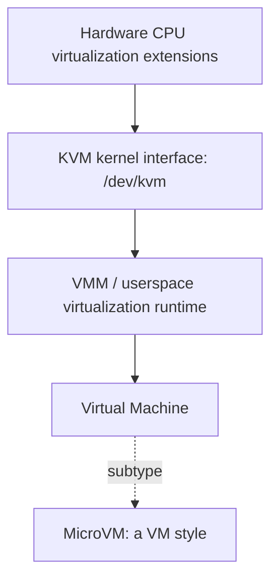
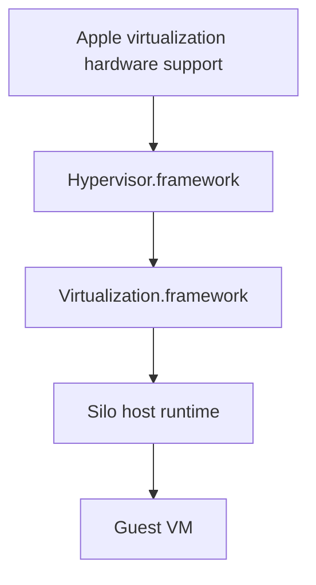
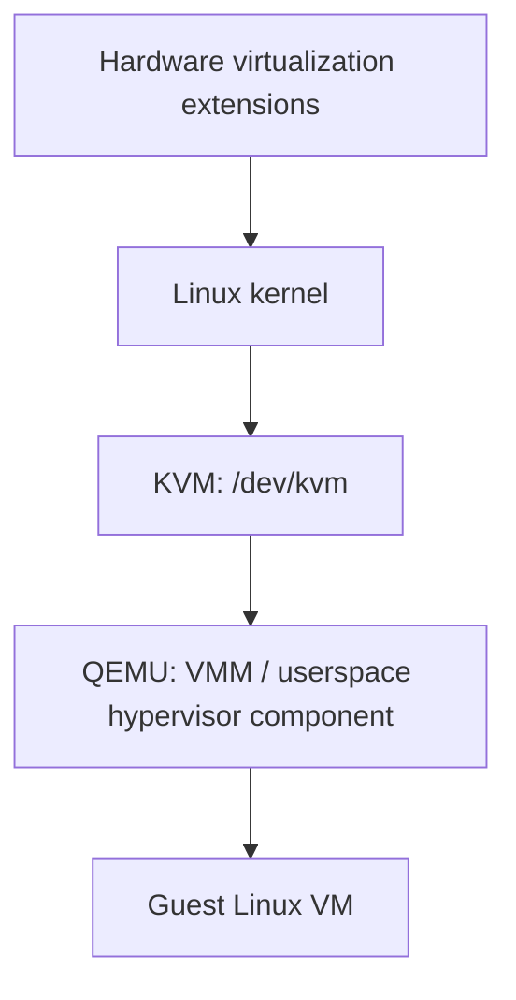
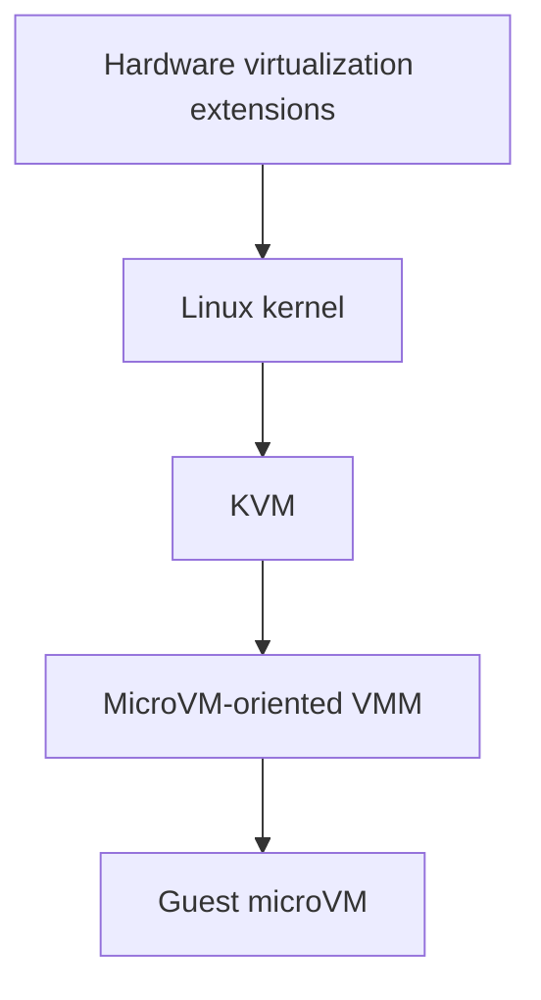
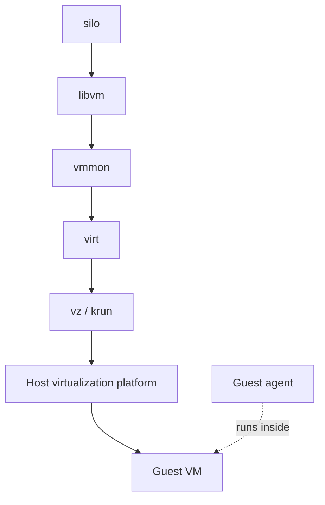

# Silo Terminology

Virtualization terms are overloaded across projects. KVM, hypervisor, VMM, VM, microVM, backend, and driver are often used loosely, especially in the cloud-native and microVM ecosystem. Silo uses the definitions below so code, docs, and architecture discussions stay pointed at the same layers.

The terms intentionally line up with the KVM, crosvm, Cloud Hypervisor, Virtualization.framework, and libvirt ecosystems where that makes the code easier to reason about.

## Stack From Bottom To Top

A simplified Linux/KVM mental model looks like this:



In plain text:

```text
Hardware CPU virtualization extensions
    -> KVM or host virtualization kernel/framework layer
    -> VMM / userspace virtualization runtime
    -> Virtual Machine (VM)

MicroVM = a specific style/category of VM
```

macOS does not have KVM, but the same conceptual split still helps. Apple hides more of the stack inside frameworks.



## KVM

KVM stands for Kernel-based Virtual Machine. It is a Linux kernel subsystem that exposes hardware virtualization features from the CPU, such as Intel VT-x or AMD-V, to userspace.

On Linux, KVM mainly exists as kernel modules and a userspace API:

- `kvm`
- `kvm_intel`
- `kvm_amd`
- `/dev/kvm`

KVM is not a complete virtual machine product. It provides low-level primitives such as:

- creating guest memory regions
- creating virtual CPUs
- entering guest execution
- injecting interrupts
- trapping VM exits back to userspace

The userspace VMM is responsible for almost everything else, including the machine model, virtual devices, boot setup, and lifecycle policy.

Think of KVM as closer to `epoll`, `io_uring`, or a GPU driver API than to VMware. It is infrastructure for virtualization, not the complete virtualization product.

## Virtual Machine / VM

A virtual machine is a fully virtualized computer environment running a guest operating system.

A VM typically contains:

- virtual CPUs
- virtual RAM
- virtual disks
- virtual NICs
- firmware, bootloader, or direct kernel boot configuration
- virtual devices

The guest OS believes it is running on real hardware, even though a VMM and host virtualization layer are mediating execution.

In user-facing Silo documentation, use "VM" when referring to an instance created, started, stopped, or deleted by Silo.

Examples:

- `silo create dev rust-dev`
- `silo start dev`
- `silo stop dev`

## Hypervisor

A hypervisor is the system responsible for creating, running, and isolating virtual machines.

Historically, this term comes from enterprise virtualization and is often split into two categories.

Type 1 hypervisors run directly on hardware:

- VMware ESXi
- Xen
- Hyper-V
- bare-metal KVM stacks

Type 2 hypervisors run on top of a host OS:

- VirtualBox
- VMware Fusion
- Parallels

In modern Linux/KVM systems, the line gets blurry. People may call KVM itself, QEMU, Cloud Hypervisor, or the combined stack "the hypervisor". Technically, KVM provides kernel virtualization support and userspace provides the actual machine model. Together they form the practical hypervisor stack.

Silo itself is not a hypervisor. It orchestrates and adapts host virtualization implementations.

## VMM

VMM stands for Virtual Machine Monitor. Historically, VMM and hypervisor were nearly synonymous. In modern systems programming, especially around KVM, VMM usually means the userspace component that manages and emulates the VM.

A VMM commonly owns:

- VM lifecycle
- vCPU management
- guest memory mappings
- device emulation
- virtio devices
- MMIO handling
- VM exits
- boot configuration

Examples of VMMs include:

- QEMU
- Cloud Hypervisor
- crosvm
- bhyve userspace components

In modern Linux virtualization, this distinction is common:

```text
KVM = kernel virtualization interface
VMM = userspace VM controller/runtime
VM = guest machine
```

Cloud Hypervisor calls itself a VMM. crosvm uses the term heavily. Silo follows that ecosystem language when describing the lower-level userspace virtualization runtime layer.

## microVM

A microVM is a VM optimized for minimal overhead, fast startup, and reduced virtual hardware surface area.

It is still a real VM. It is not a container and not a different primitive.

MicroVMs usually:

- boot very quickly
- use small memory footprints
- expose minimal devices
- avoid legacy PC hardware emulation
- prefer virtio-only devices
- target ephemeral or isolated workloads

Examples and adjacent projects include:

- Cloud Hypervisor
- crosvm
- Kata Containers

Traditional VMs often emulate a broad PC platform, including PCI buses, VGA, USB, BIOS, ACPI, or IDE controllers. MicroVMs intentionally avoid most of that surface area. They usually prefer direct kernel boot, virtio devices, and a minimal MMIO model.

Silo primarily targets microVM-style workloads. Not every supported host virtualization stack needs to use the exact term "microVM", but Silo should prefer implementations and configurations that fit this model.

## Example Virtualization Stacks

Traditional QEMU/KVM-style stack:



KVM-backed microVM-style stack:



macOS Virtualization.framework stack:


## Virtualization Backend

A virtualization backend is the concrete host implementation Silo uses to run a VM.

Current Silo runtime backend selection is internal and host-driven:

- macOS uses Apple Virtualization.framework through `vz`
- Linux uses libkrun/krun through `krun`

Users do not select a backend in `VmSpec`. `VmSpec` describes the VM, while Silo chooses the host implementation at compile time.

In Silo, "backend" is a practical project term. It names the concrete implementation path selected by host platform; it is not meant to replace the more precise ecosystem terms VMM, hypervisor, VM, or KVM.

## Backend Driver

A backend driver is the Rust adapter code that implements support for a virtualization backend inside Silo.

Examples:

- `vz`
- `krun`

Use "driver" for Silo adapter code. Use "VMM" for the lower-level userspace virtualization implementation/runtime when that layer exists as a distinct concept.

## Silo Components

The Silo runtime layers sit above the host virtualization stack:



### `virt`

`virt` is Silo's host virtualization facade.

It exposes the common Rust API that `vmmon` uses to create, start, stop, and communicate with a VM. The concrete implementation is selected at compile time by host platform.

The exported `VirtualMachine` type is Silo's per-instance VM handle. It is not the guest OS and it is not the underlying VMM implementation. It is the API handle used by Silo code to control one VM.

`virt` is not a hypervisor. It is also not the product-level VM manager.

### `vmmon`

`vmmon` is the VM monitor process.

It supervises one running VM, exposes monitor and control APIs, tracks lifecycle state, handles guest readiness, and participates in cleanup and reconciliation.

`vmmon` uses `virt` to start and control the host-selected virtualization implementation. It is Silo's process-level supervisor around one VM, not the guest VM itself.

### `libvm`

`libvm` is the higher-level VM orchestration library.

It owns product-level lifecycle semantics, persisted state, image handling, launch flow, and interaction with `vmmon`.

Its role is similar in spirit to how libpod sits above lower-level container runtime pieces.

### Guest Agent

The guest agent is software running inside the guest VM.

It is separate from the VMM, `virt`, and `vmmon`. It provides guest-side services such as readiness, shell support, or bootstrap integration.

### Host

The host is the operating system running Silo.

Examples:

- macOS host using Apple Virtualization.framework
- Linux host using KVM-backed virtualization

### Guest

The guest is the operating system running inside the VM.

## Most Important Distinction

The most common conceptual mistake is collapsing KVM, VMM, and VM into one thing.

They are different layers:

- KVM is the Linux kernel virtualization interface.
- The VMM is the userspace program controlling and emulating the VM.
- The VM is the guest machine itself.

Or, aggressively compressed:

```text
KVM is not the VM.
KVM is not the VMM.
The VMM controls the VM through KVM or another host virtualization layer.
```
